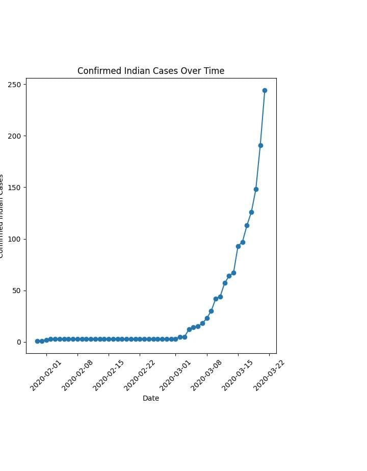
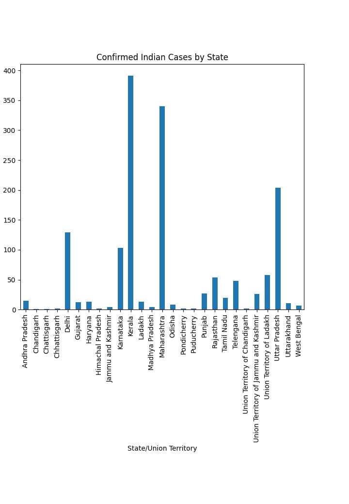
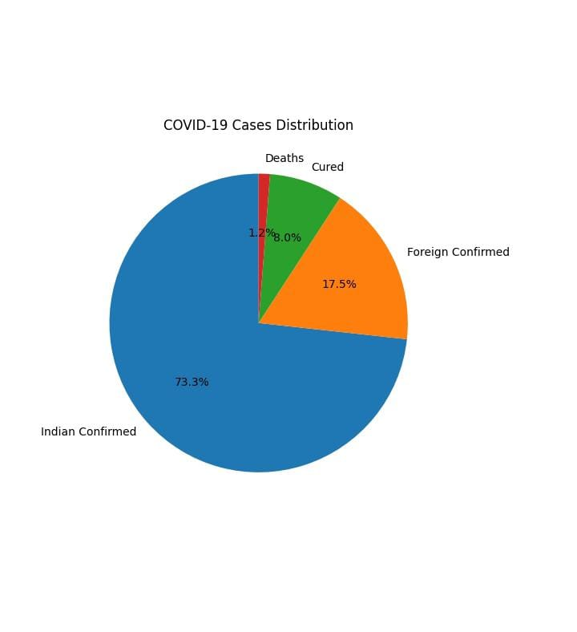
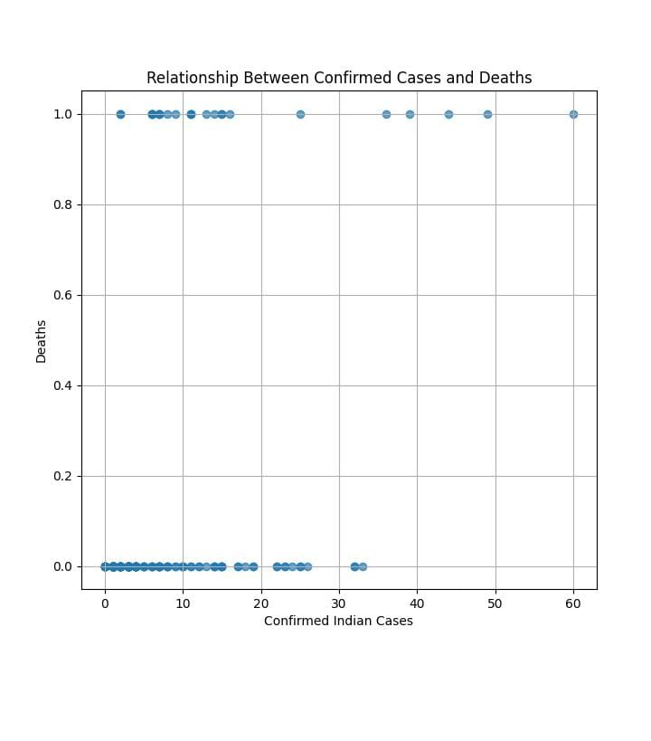
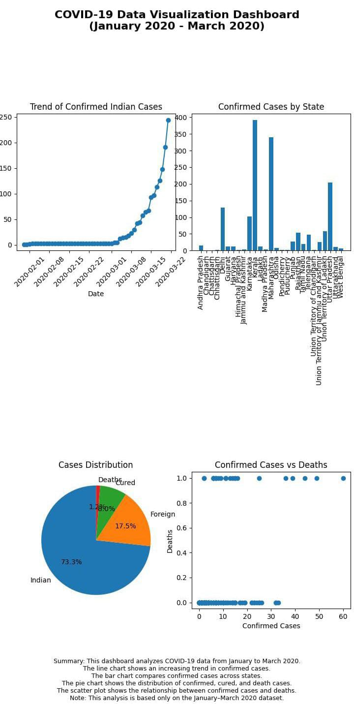

# CodeAlpha_DataVisualisation(Task3)
COVID-19 Data Visualization – A Python project that visualizes COVID-19 data from January 2020 to March 2020 using Pandas, Matplotlib, and Seaborn. The project presents key trends and insights through various charts and graphs for better understanding of the dataset.
## Project Overview
This project analyzes COVID-19 data from January 2020 to March 2020 using Python. It transforms raw data into meaningful visualizations to identify trends, compare cases, and support data-driven decision-making.

## Objective
- Transform raw data into visualizations.
- Analyze COVID-19 trends.
- Compare confirmed cases across states.
- Build a dashboard for better understanding.

## Dataset
COVID-19 India Dataset (January 2020 – March 2020)

## Tools Used
- Python
- Pandas
- Matplotlib
- Pydroid 3

##Output Visualizations
- 📈 Line Chart – Shows the trend of confirmed cases over time.
- 📊 Bar Chart – Compares confirmed cases across states.
- 🥧 Pie Chart – Shows the distribution of confirmed, recovered, foreign, and death cases.
- ⚫ Scatter Plot – Shows the relationship between confirmed cases and deaths.
- 📋 Dashboard – Combines all visualizations into one view.

## Key Insights
- Confirmed COVID-19 cases increased during January–March 2020.
- Some states had higher confirmed cases than others.
- Confirmed Indian cases formed the largest share of the dataset.
- Deaths generally increased as confirmed cases increased.

## Conclusion
This project demonstrates how data visualization helps convert raw data into meaningful insights. The dashboard provides a clear overview of COVID-19 trends and supports better understanding of the data.
## Visual Outputs

### Line Chart

### Bar Chart

### Pie Chart

### Scatter Plot

### Dashboard

